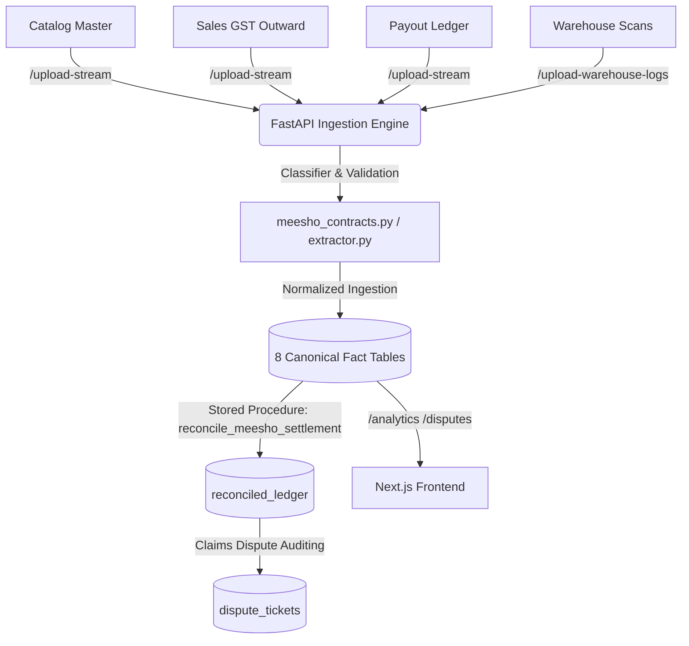

# E-Commerce Financial OS & Reconciliation Tool: System Architecture

This document details the contract-driven system design, canonical fact data model, and mathematical reconciliation engine developed for e-commerce platforms.

---

## 1. System Architecture Overview

The system is designed as a **Contract-Driven Reconciliation Engine**. Rather than using generic staging tables, incoming Excel/CSV files are matched to defined report contracts, validated, and parsed directly into 8 canonical fact tables.

### Technology Stack
*   **Frontend**: Next.js 16 (React 19, TypeScript, TailwindCSS, Webpack). Glassmorphic dark UI.
*   **Backend**: FastAPI (Python), Pandas (chunk-stream data parsing), SQLAlchemy (ORM), and RapidFuzz (fuzzy column matching).
*   **Database**: Supabase PostgreSQL. Enforces Row Level Security (RLS) on user ID and optimizes join indices.

---

## 2. Contract-Driven Metadata & Canonical Model

### A. Report Contracts & Ingestion Log Tables

*   **`report_contracts`**: Holds configurations for each report type, including platform, report family (e.g. `gst_sales`, `payout`), aliases, required worksheets, offsets, sign multiplier rules, and date formats.
*   **`raw_file_uploads`**: Captures metadata for every upload attempt. Records file hashes (uniqueness scoped by `user_id`, `platform`, `report_contract_id` via `uq_user_file_hash`), detected sheets, mapped/unmapped columns, empty sheets, confidence levels (`screenshot_observed` vs `live_sample_verified`), and validation errors.

### B. 8 Canonical Fact Tables

Raw files are transformed and ingested directly into these structured transactional fact tables:

1.  **`fact_payout_batches`**: Unique payout transfer batches (NEFT/Bank Settlement ids) and gross payment values.
2.  **`fact_order_items`**: Line item quantities, catalog SKUs, HSNs, product names, and order timestamps.
3.  **`fact_tax_invoices`**: Tax values, CGST, SGST, IGST details, invoice states, and invoice values.
4.  **`fact_fee_lines`**: Platform commission, logistics fees (forward shipping, return shipping), ads spend, and warehousing charges.
5.  **`fact_settlement_events`**: Settlement payout cash flows mapped to payout batches.
6.  **`fact_adjustment_events`**: Programs waivers, referral rewards, discounts, and customer adjustments.
7.  **`fact_tax_deductions`**: TCS and TDS deductions.
8.  **`fact_claim_events`**: Portals compensations, lost inventory claims, and chargeback recoveries.

---

## 3. Platform-Specific Cleansing Workflows (Meesho)

1.  **Group Header Combination**: Payout sheets merge groups in Row 1 and column headers in Row 2. The parser forward-fills Row 1 categories and combines them with Row 2 column names (e.g. `Deductions_TCS`, `Payment Details_Final Settlement Amount`) to resolve duplicate column labels.
2.  **Skipping Formula & Multi-Sheet Routing**: Automatically skips Row 3 formulas, starts reading data from Row 4, and parses sheets (`Disclaimer`, `Order Payments`, `Ads Cost`, `Referral Payments`, `Compensation and Recovery`) using nullable `sub_order_num` rules. Empty sheets with warning labels (like "No data is available") are gracefully logged in metadata.
3.  **GST Horizontal Block Slicing**: Meesho GST outward spreadsheets pack Outward Sales and Return Credit Notes side-by-side on the same sheet. The engine slices the sheet horizontally by column indices or suffix markers (e.g. `.1`), extracting separate clean dataframes for forward sales versus returned transactions.
4.  **Dynamic Sign Resolution**: Column/transaction signs for Claims, Recovery, GST Compensation, and Waivers are resolved dynamically using multipliers in the contract's `amount_sign_rules_json` configuration rather than hardcoded assumptions.

---

## 4. Ingestion & Validation Modules

*   **[meesho_contracts.py](file:///C:/Users/cavis/.gemini/antigravity/scratch/tax-recon-saas/backend/meesho_contracts.py)**: Defines Pydantic validation schemas and static contract parameters (aliases, columns, skips, offsets).
*   **[extractor.py](file:///C:/Users/cavis/.gemini/antigravity/scratch/tax-recon-saas/backend/extractor.py)**: Performs classifier matching, horizontal block slicing, payout combined header formatting, date/numeric transformations, and database stream persistence.
*   **Validation Rules**: Implements pre-ingestion validation for required columns, file-hash duplicates, invalid date formats, and incorrect GSTIN lengths.

---

## 5. Core SQL Reconciliation Engine (`reconcile_meesho_settlement`)

When clicking **Run Reconciliation** on the dashboard, the backend triggers the `reconcile_meesho_settlement(user_id, period_from, period_to)` stored procedure.

### A. Component-Based Expected Settlement Formula
Expected Settlement is computed per `sub_order_num` from the canonical facts tables using the following formula:

$$\text{Expected Payout} = \text{Total Sale Amount} - \text{Total Sale Return Amount} - \text{Commission} - \text{Fixed Fee} - \text{Warehousing Fee} - \text{Shipping Charge} - \text{Return Shipping Charge} - \text{Return Premium} - \text{Platform Fees} - \text{Other Support Service Charges} - \text{TCS} - \text{TDS} + \text{Waivers} + \text{Compensation} - \text{Recovery / Claims}$$

*   **Total Sale Amount**: Outward supply invoice values.
*   **Total Sale Return Amount**: Credit note refund values.
*   **Commission / Fees / Shipping**: Total fee lines from `fact_fee_lines`.
*   **TCS / TDS**: Tax deductions from `fact_tax_deductions`.
*   **Waivers / Rewards**: Program adjustments from `fact_adjustment_events`.
*   **Compensation / Recovery**: Claims events from `fact_claim_events` multiplied by their contract-specified `amount_sign_rules_json` sign.

---

## 6. How Dashboard Tabs are Calculated

### A. Audit & Rec Tab
Loads the summary metrics for the selected user and month from `reconciled_ledger`:
*   **Total Orders**: `COUNT(order_id)`
*   **Flagged Count**: `COUNT(order_id) WHERE risk_flag != 'OK'`
*   **Variance**: `SUM(ABS(variance))`
*   **Risk Chart**: Groups counts by `risk_flag` category.

### B. Profits & Ops Tab
Calculates product unit margins and safety inventory metrics:
*   **Gross Revenue**: `SUM(gross_sales)`
*   **Returns Refund**: `SUM(refund_amount)`
*   **Net Revenue**: `SUM(gross_sales) - SUM(refund_amount)`
*   **Platform Fees**: `SUM(marketplace_fee)`
*   **COGS**: `SUM(cost_price)`
*   **Total Profit**: `Net Revenue - COGS - Platform Fees`
*   **SKUs Table**:
    *   **Sold**: Quantity sold.
    *   **Net Revenue**: Invoiced sales - Refunds.
    *   **Fees**: Commission + logistics.
    *   **Profit Margin %**: `(Product Profit / Net Revenue) * 100`

### C. India Heatmap Tab
Collects shipping state densities from `reconciled_ledger`:
*   Aggregates `SUM(gross_sales)` grouped by `shipping_state`.
*   Renders an SVG map of India's state boundaries, applying a linear color gradient representing high vs. low sales volumes.

### D. Disputes & Claims Tab
Fetches records from `dispute_tickets` for the logged-in user:
*   Lists tickets with attributes: Order ID, Channel, Type, Disputed Amount, Status, and description.
*   Enables users to toggle statuses (`OPEN` -> `FILED` -> `RESOLVED`) and exports the filtered list as a CSV file for marketplace claims filing.
